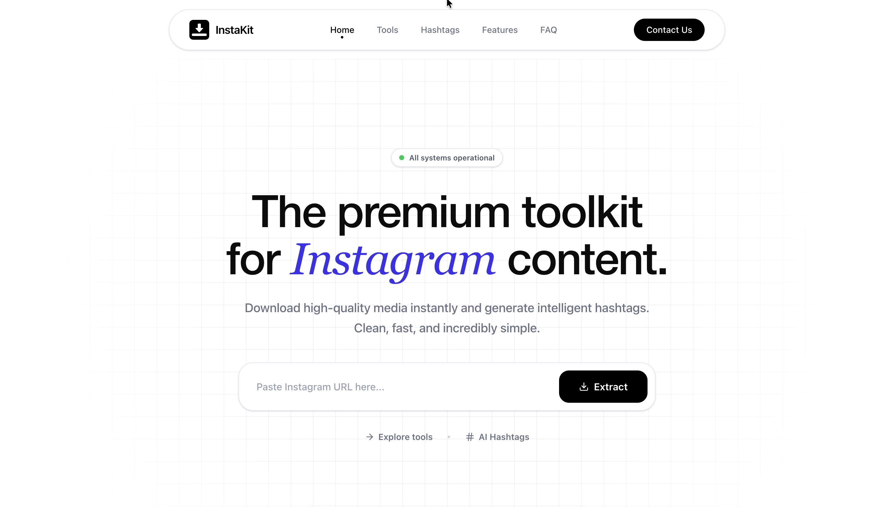

<p align="center">
  
</p>

<h1 align="center">InstaKit</h1>

<p align="center">
  <strong>A premium, minimalist toolkit to download Instagram media and generate AI hashtags with zero friction.</strong>
</p>

<p align="center">
  
</p>

---

## 🚀 Features

- **Photo Downloader:** Extract and download post photos in full studio HD resolution (1080px).
- **Reels & Video Downloader:** Stream and save high-quality MP4 video tracks directly.
- **HD Profile Picture Downloader:** Search and extract high-resolution avatar images (sorted up to 320x320px).
- **AI Hashtag Generator:** Generate targeted, trending hashtags to increase content visibility using advanced NLP parsing.
- **Unified Proxy Download Engine:** Bypasses browser CORS blocks by streaming content directly from Instagram CDNs.
- **Ultra-Fast Hybrid Scraper:** Resolves public post requests in **~1.2 seconds** using direct Axio-crawling fallback pipelines.

---

## 🛠️ Tech Stack

### Frontend
- **Framework:** React + Vite
- **Styling:** Tailwind CSS + Vanilla CSS Layout Tokens
- **Animations:** Framer Motion
- **Icons:** Lucide React + React Icons

### Backend
- **Server:** Node.js + Express
- **Scraping Engine:** Puppeteer + Axios Googlebot Crawler
- **Proxy Streamer:** Axios Binary Stream pipes

---

## ⚙️ Getting Started

### 1. Start the Backend Server
Navigate to the root directory and start the proxy server:
```bash
node server.js
```
The server will run on `http://localhost:3001`.

### 2. Start the Frontend Dev App
Start the Vite development build server:
```bash
npm run dev
```
Open `http://localhost:5173` in your web browser.

### 3. Generate a Production Build
Compile the frontend client code:
```bash
npm run build
```
The compiled static build files will output to the `/dist` directory.
